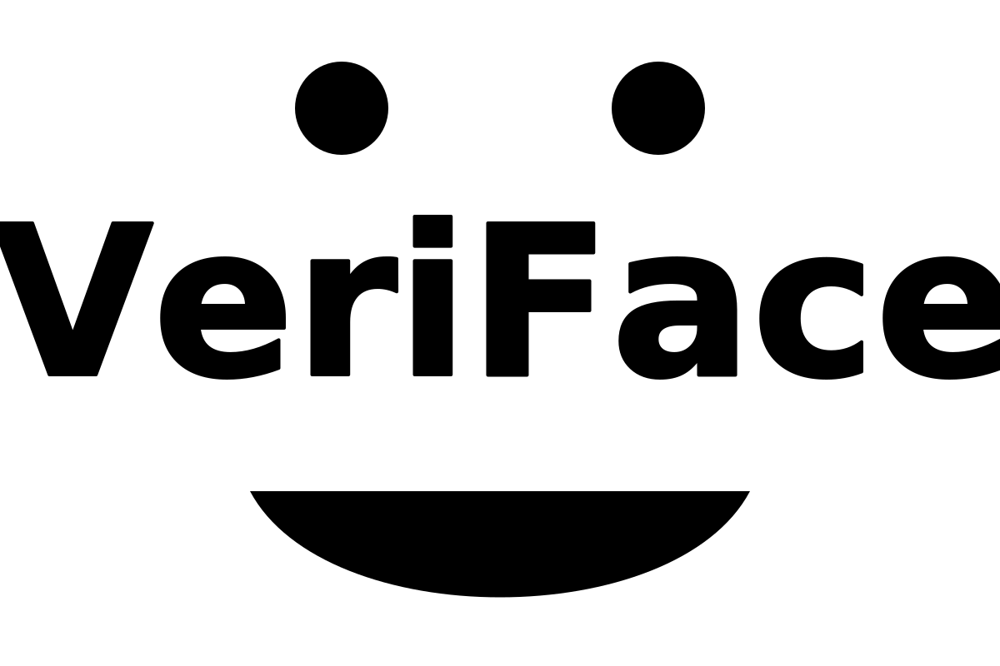
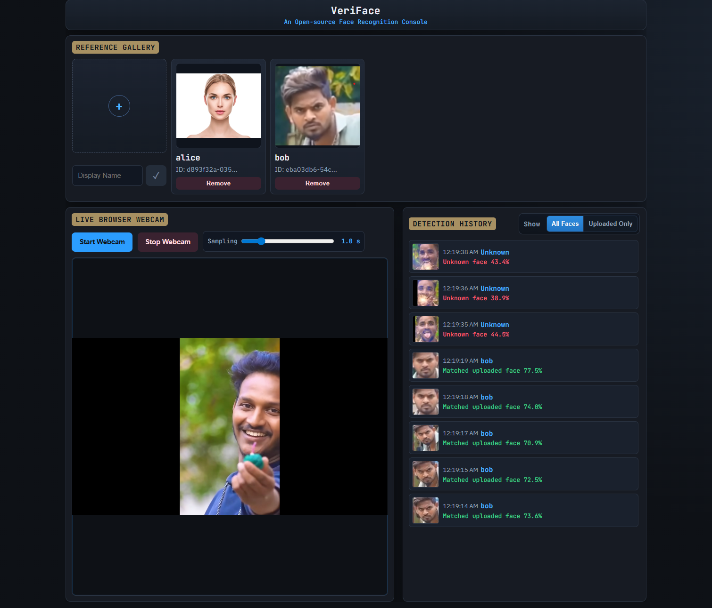

# VeriFace

<p align="center">
  
</p>

<p align="center"><strong>Open-source, browser-first face recognition system.</strong></p>

VeriFace is a browser-first face recognition app built with FastAPI, `face_recognition`, and OpenCV.
Webcam frames are captured in the browser and sent to the backend for matching against uploaded references.

## Demo

<p align="center">
  
</p>

## Key Features

- Browser webcam capture only (`getUserMedia`)
- Reference enrollment with duplicate-face protection
- Adjustable sampling interval for frame recognition
- Detection history with timestamp, identity, confidence, and face crop
- Result mode filtering: `all` or `matched-only`
- HTTPS-first deployment via Docker Compose

## Tech Stack

- Backend: FastAPI, `face_recognition`, `opencv-python-headless`
- Frontend: Vanilla HTML/CSS/JavaScript
- Deployment: Docker + Docker Compose

## Project Structure

```text
app/
  main.py            # FastAPI routes
  face_registry.py   # Reference enrollment and deduplication
  models.py          # API request/response models
static/
  app.js             # Frontend runtime logic
  styles.css         # UI styles
templates/
  index.html         # Main web interface
data/
  references/        # Persisted reference images
docs/
  assets/
    demo.png
    veriface-logo.svg
Dockerfile
docker-compose.yml
start.sh
requirements.txt
```

## Quick Start (Docker Compose, HTTPS)

### Prerequisites

- Docker Engine + Docker Compose plugin
- TLS files at:
  - `certs/cert.pem`
  - `certs/key.pem`

### Build and Run

```bash
docker compose up --build
```

Run in detached mode:

```bash
docker compose up -d --build
```

Stop services:

```bash
docker compose down
```

Open app:

`https://<host-or-ip>:8443`

## Usage Flow

1. Upload one face image and enter a display name.
2. The backend validates the image (exactly one face).
3. Duplicate face enrollment is rejected automatically.
4. Start webcam from the browser UI.
5. Frames are sent periodically based on the selected sampling interval.
6. Recognition results are appended to Detection History.

## API Overview

### `POST /api/references`

Enroll a reference face.

Form-data:
- `label` (optional)
- `image` (required, jpg/jpeg/png)

Common errors:
- Unsupported file format
- No face detected
- More than one face detected
- Duplicate face already enrolled

### `GET /api/references`

List enrolled references.

### `GET /api/references/{reference_id}/image`

Get stored reference image.

### `DELETE /api/references/{reference_id}`

Delete a reference by ID.

### `POST /api/browser-recognition`

Recognize faces from a browser frame.

```json
{
  "image_base64": "data:image/jpeg;base64,...",
  "reference_ids": ["id-1", "id-2"],
  "result_mode": "matched-only"
}
```

`result_mode` values:
- `all`
- `matched-only`

## Notes

- Webcam permission is handled by the browser.
- For LAN/non-localhost camera access, HTTPS is recommended.
- Recognition speed depends on CPU and frame resolution.
- Data is persisted via `./data:/app/data` volume mount.

## Troubleshooting

### Camera does not start

- Grant camera permission in browser settings.
- Verify valid HTTPS certificate setup.
- Ensure no other app is locking the webcam.

### Upload is rejected

- Use JPG/JPEG/PNG only.
- Ensure the image contains exactly one visible face.

### Recognition is slow

- Increase sampling interval.
- Lower webcam resolution.
- Allocate more CPU resources to Docker.
